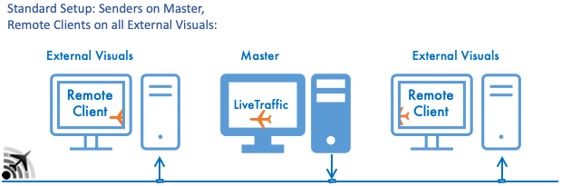

XPMP 2 and XPMP2 Remote Client
=========

The original X-Plane Multiplay Library is the work of many fantastic people,
with Ben Supnik, Chris Serio, and Chris Collins appearing in recent files and documentation.
But the origins date back to 2004, and very likely many more were involved. Thanks to all of them!

This complete re-implementation honours all the basic concepts (so I hope)
but makes use of now 3 modern X-Plane 11 concepts:
- [instancing](https://developer.x-plane.com/sdk/XPLMInstance/),
- [TCAS Override](https://developer.x-plane.com/article/overriding-tcas-and-providing-traffic-information/), and
- [Wake Turbulence](https://developer.x-plane.com/2022/02/wake-turbulence/)

Thus, it ports the idea of the library also into the times of Vulkan and Metal
when the drawing mechanisms used by the original library no longer work.

At the same time, using instancing marks basically all parts of the original rendering code
of the library outdated...it is basically replaced by one line of code calling
`XPLMInstanceSetPosition`.

Concepts like the syntax of the `xsb_aircraft.txt` file or certainly the idea of an
multi-pass matching to find a good model are retained, though re-implemented.

XPMP2 does no longer call any OpenGL function and hence does not require
to be linked to an OpenGL library. The included XPMP2 Remote Client and
XPMP2-Sample applications do not link to OpenGL.

Despite its new approach, XPMP2 shall be your **drop-in replacement for libxplanemp**:
The original header files are still provided with the same name.
All original public functions are still there.
The original [XPCAircraft class](https://twinfan.github.io/XPMP2/html/classXPCAircraft.html)
is still there, now derived from [XPMP2::Aircraft](https://twinfan.github.io/XPMP2/html/classXPMP2_1_1Aircraft.html).
See [here](https://twinfan.github.io/XPMP2/BackwardsCompatibility.html) for more details.

## Pre-Built Library Release ##

If you don't want to build the library yourself you can find archives with
headers and release/debug builds in the
[Release section](https://github.com/TwinFan/XPMP2/releases)
here on GitHub.

## Status ##

Available, and should be rather reliable now. No (major) bugs are known.
Future development can certainly extend functionality while trying hard
to stay backward compatible.

The XPMP2 library has been successfully tested with
- X-Plane 11.5x under OpenGL, Vulkan, and Metal,
- X-Plane 12,
- the [XPMP2 Remote Client](#XPMP2-Remote-Client-Synchronizing-Planes-across-the-Network),
- the [`XPMP2-Sample` plugin](https://github.com/TwinFan/XPMP2-Remote),
- [LiveTraffic](https://forums.x-plane.org/index.php?/files/file/49749-livetraffic/)
- [X-Pilot](http://xpilot-project.org/)
- X-Plane version of [IVAO Altitude](https://www.ivao.aero/softdev/beta/altitudebeta.asp)
- on Mac OS,
- Windows, and
- Linux (Ubuntu 20.04 and similar).

## Requirements ##

- XPMP2 implements [instancing](https://developer.x-plane.com/sdk/XPLMInstance/),
  so it **requires X-Plane 11.10** or later
- CSL models in **OBJ8 format** (ie. older OBJ7 models are no longer supported)
- Potentially an FMOD license if built with FMOD sound support, see 
  [Sound Support](#sound-support)

## Documentation: See [GitHub pages](https://twinfan.github.io/XPMP2/) ##

...on requirements, API, building, deployment, TCAS target, CSL mode dataRefs
and more is available in the
[GitHub pages](https://twinfan.github.io/XPMP2/).

### Sample Plugin ###

The separate
[_Public Template_ repository `XPMP2-Sample`](https://github.com/TwinFan/XPMP2-Sample)
provides a complete
plugin including build projects and CMake setup and can be the basis for your plugin project.
It displays 3 aircraft flying circles in front of the user's plane.
Each of the 3 aircraft is using a different technology:
the now recommended way of subclassing `XPMP2::Aircraft`, the legacy way
of subclassing `XPCAircraft` (as used by LiveTraffic v1.x), and by calling
standard C functions.

The [HowTo documentation](https://twinfan.github.io/XPMP2/HowTo.html#sample-plugin)
includes how to install the sample plugin, especially also CSL models.

## Main Features ##

### Model Matching ###

The way how XPMP2 picks any of the available CSL models for display
is [documented here](https://twinfan.github.io/XPMP2/Matching.html).

### Enhancing CSL Models ###

CSL packages come in different flavours. Popular ones for general use are
the Bluebell and the X-CSL packages. Both come with different history.
For XPMP2 to use all their features (all liveries, turning rotors, props, wheels...)
it needs to adapt their `.obj` files. Performing these changes is built into XPMP2,
[details here](https://twinfan.github.io/XPMP2/CopyingObjFiles.html).

XPMP2 offers a wide range of animaton dataRefs that can be used in CSL models,
[details here](https://twinfan.github.io/XPMP2/CSLdataRefs.html).

### TCAS and AI/multiplayer Support ###

XPMP2 provides TCAS blibs and AI/multiplayer data using
[TCAS Override](https://developer.x-plane.com/article/overriding-tcas-and-providing-traffic-information/)
introduced with X-Plane 11.50 Beta 8. Find
[details here](https://twinfan.github.io/XPMP2/TCAS.html)
including a reference lists of provided dataRef values and their sources.

When TCS Override is not available (like up to X-Plane 11.41),
then TCAS is provided by writing the classic multiplayer dataRefs directly.

Beyond the standard set of information by X-Plane's family of dataRefs,
XPMP2 also supports a set of shared dataRefs for providing
textual aircraft and flight information,
[details here](https://twinfan.github.io/XPMP2/SharedDataRefs.html).

### Wake Turbulence ###

X-Plane 12 started to
[support wake turbulence](https://developer.x-plane.com/2022/02/wake-turbulence/)
also for TCAS targets. As a trade-off between complexity (knowing exact
wing dimensions and weight/lift of any plane) and results (strength of the wake)
XPMP2 applies defaults to the aircraft dimensions based on the
Wake Turbulence Category (WTC) listed in the `Doc8643` data.

A plugin using XPMP2 can opt to provide its own values for even more
precice results.

Find [more details here](https://twinfan.github.io/XPMP2/Wake.html).

### Sound Support ###

All displayed aircraft can produce sound in the 3D world for
engine, reversers, taxiing, gear and flap movement.

There are 2 options:
- As of X-Plane 12.04, XPMP2 can use X-Plane's new
  [Sound API](https://developer.x-plane.com/sdk/XPLMSound/) and hence
  integrate sounds with X-Plane's own FMOD instance; this does not
  need linking and licensing your plugin with FMOD, but is restricted
  to rather simple forms of `.WAV` sound file formats.
- When building with FMOD support directly, then XPMP2's Audio Engine is
  FMOD Core API by Firelight Technologies Pty Ltd.
  Understand FMOD [licensing](https://www.fmod.com/licensing) and
  [attribution requirements](https://www.fmod.com/attribution) first,
  as they will apply to _your_ plugin if using XPMP2 with sound support.

Because of the FMOD licensing requirements, XPMP2 by default is built
without FMOD library support, but always supports X-Plane 12's
internal Sound API out of the box.

See the [Sound Support documentation](https://twinfan.github.io/XPMP2/Sound.html)
for details how to enable sound support and how to include it into your plugin.

### Map Layer ###

XPMP2 creates an additional layer in X-Plane's internal map, named after the
plugin's name. This layer displays all planes as currently controled by XPMP2
with an icon roughly matching the plane type, taken from `Resources/MapIcons.png`.

## XPMP2 Remote Client: Synchronizing Planes across the Network ##

Planes displayed using XPMP2 can by synchronized across the network.
The included **XPMP2 Remote Client** needs to run on all remote computers,
receives aircraft data from any number of XPMP2-based plugins anywhere
in the network, and displays the aircraft using the same CSL model,
at the same world location with the same animation dataRefs.

This supports usage in setups like
- [Networking Multiple Computers for Multiple Displays](https://x-plane.com/manuals/desktop/#networkingmultiplecomputersformultipledisplays),
- [Networked Multiplayer](https://x-plane.com/manuals/desktop/#networkedmultiplayer),
- but also just locally as a **TCAS Concentrator**, which collects plane
  information from other local plugins and forwards them combined to TCAS
  and classic multiplayer dataRefs for 3rd party add-ons.

For end user documentation refer to
[LiveTraffic/XPMP2 Remote Client](https://twinfan.gitbook.io/livetraffic/setup/installation/xpmp2-remote-client)
documentation.

For more background information refer to
[GitHub XPMP2 documentation](https://twinfan.github.io/XPMP2/Remote.html).

One of many possible setups:

