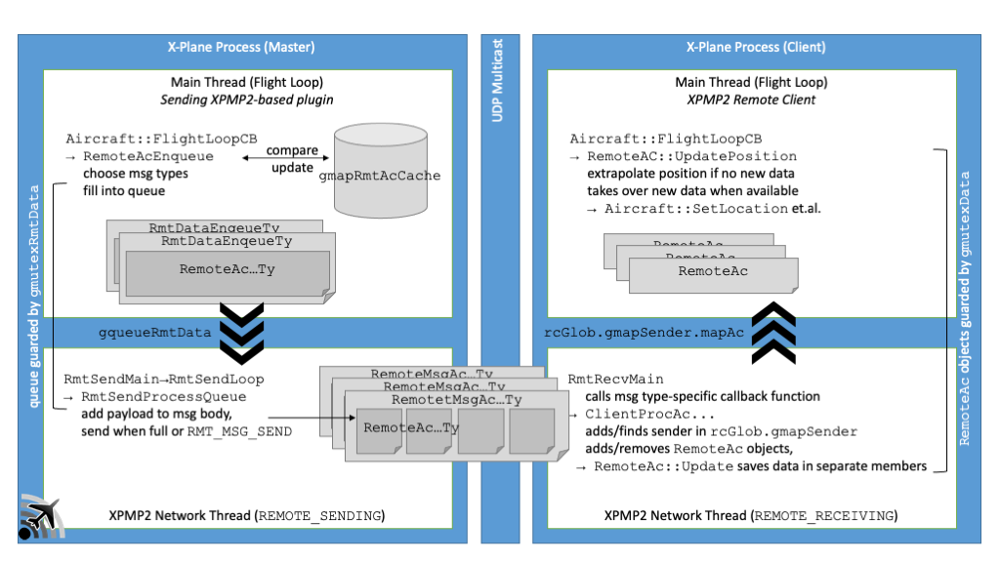
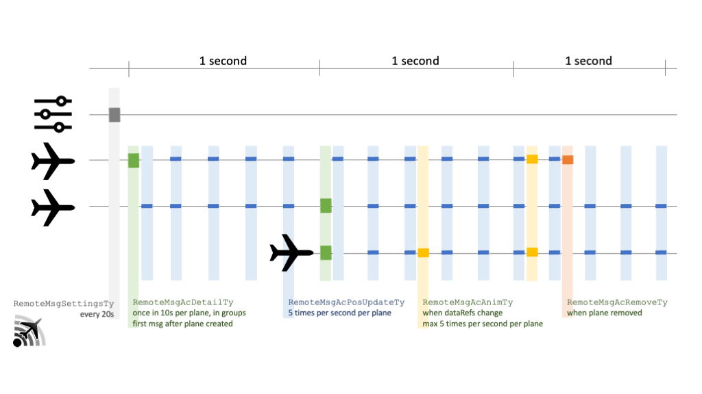

XPMP2 Remote Functionality
==

This page explains the technical background of the XPMP2 Remote functionality.
For end user documentation refer to
[LiveTraffic/XPMP2 Remote Client](https://twinfan.gitbook.io/livetraffic/setup/installation/xpmp2-remote-client)
documentation.

## Support in your Plugin ##

You do not need to do anything specifically in your plugin to support
the Remote functionality. Just build and link with the latest XPMP2 library.
Don't even ship the Remote Client, but refer to the
[download location](https://forums.x-plane.org/index.php?/files/file/67797-xpmp2-remote-client/),
which is maintained centrally.

Optionally, you _could_ respond to the new `XPMP_CFG_ITM_SUPPORT_REMOTE` configuration
item in your `XPMPIntPrefsFuncTy` configuration callback function, e.g. to provide the
user with an option to switch Remote support on regardless of
network configuration. However, the default, "auto-detect", works in by far
most scenarios already. And in the few others the users would still have
the chance to use the XPMP2.prf config file
[as documented](https://twinfan.gitbook.io/livetraffic/setup/installation/xpmp2-remote-client#adjusting-network-configuration).

Optionally, you _could_ react to an inter-plugin message `XPLM_MSG_RELEASE_PLANES` from
the XPMP2 Remote Client and cede TCAS/AI control in that case
because the Remote Client will take care of your TCAS in that case, too,
but will also have the chance to pick up planes of other XPMP2-based
plugins.
See [LiveTraffic's XPluginReceiveMessage function](https://github.com/TwinFan/LiveTraffic/blob/bba4912ebfe3203689e029f1786607ab897fe597/Src/LiveTraffic.cpp#L578)
for an example.

## Basic Ideas ##

- There are **senders** (the actual XPMP2-based plugins) disseminating position information via UDP multicst into the local network.
- There is one centrally provided **XPMP2 Remote Client** plugin per networked PC,
  which is part of the XPMP2 project. This client reads those multicast messages
  and displays the aircraft in the networked PCs.
- The XPMP2 master shall be independent of the X-Plane master.
  This would allow to run the XPMP2 master on another of the networked PCs for
  load balancing. Or to use the same principle for networked gaming setup with
  several totally independent players, which still could share the same
  XPMP2-driven planes.
- It is possible to collect multicast data from different XPMP2-driven plugins,
  even if they run on different PCs. So the Remote Client is able to identify
  different sources and map their aircraft ids in case they are in conflict.
- Standard setup is "zero-config":
    - The masters will first _listen_ to the multicast port. As soon as they
      receive something they will start broadcasting their own data, too.
    - The clients will first send a "Beacon of interest" message on the multicast
      address and repeat that every once in a while until they eventually
      receive actual data.
- Masters send their configuration regularly.
    - The client needs to replicate relevant configuration settings like
      logging level, replace dataRefs/textures, label and map settings;
    - as different masters could be configured differently the client decides
      for a "best effort" config for each of these items.
- The Remote Client requests TCAS/AI right on startup. This is not perfectly
  in line with [TCAS plugin coordination rules](https://developer.x-plane.com/article/overriding-tcas-and-providing-traffic-information/#Plugin_coordination),
  but necessary so that the Remote Client can actually combine all the other
  plugins' position data into one central TCAS/AI stream.
- The network messages include per plane:
    - Position, attitude
    - Model (the client needs to have the same set of CSL models installed,
      and it still needs to be able to do its own matching in case the
      requested model is not accessible)
    - Configuration, ie. the array of animation dataRefs
    - To save network bandwidth data compression is applied:
        - Full data set only every once in a while (so that clients have a chance
          to fully synch with a new plane),
        - diff data only inbetween, animation dataRefs only if they really change...
- Special situations handled specially:
    - Change of visibility
    - Change of CSL model
    - Removal of aircraft
    - Stale aircraft (not updated in some time)
    - Stale sender (not sending in some time)
- Read an _optional_ config file to be able to change a few parameters and
  enforce network functionality
    - Read by all XPMP2-based plugins, including Remote Client
    - Example provided as Resources/XPMP2.example.prf
    - Includes switch on/off/auto, port, multicast address, max msg length

## Application Architecture ##

## Network Message "Protocol" ##

- Plugin's settings `RemoteMsgSettingsTy` (grey)
    - are sent every 20 seconds,
    - contain plugin information like its name,
    - contain relevant configuration settings,
    - are used by the Remote Client to learn about senders;
      planes can only be processed from known senders.
- Fully detailed `RemoteMsgAcDetailTy` messages (green)
    - contain information for several planes, each plane occupying a
      fixed-length "record" in the message,
    - introduces new planes (the plane icon in the bottom row),
    - are regularly sent every 10s per plane, all planes equally distributed
      over this 10 second period,
    - allows the Remote Client to create new planes and fully synchronize
      all data every 10 seconds.
- Position update `RemoteMsgAcPosUpdateTy` messages (blue)
    - contain information for several planes, each plane occupying a
      fixed-length "record" in the message,
    - include differential position updates only for space efficiency,
    - can be processed by the Remote Client only for already known planes.
- Animation dataRef `RemoteMsgAcAnimTy` messages (orange)
    - contain information for several planes,
    - are variable-length even per plane as only actually changed dataRef
      values are included as key/value pairs,
    - all values are reduced from `float` to 8 bit `uint8_t` values for
      space efficiency,
    - can be processed by the Remote Client only for already known planes.
- Plane removal `RemoteMsgAcRemoveTy` messages (red)
    - contain information for several planes, each plane identified by an
      internal id only,
    - inform the Remote Client to remove that plane.

